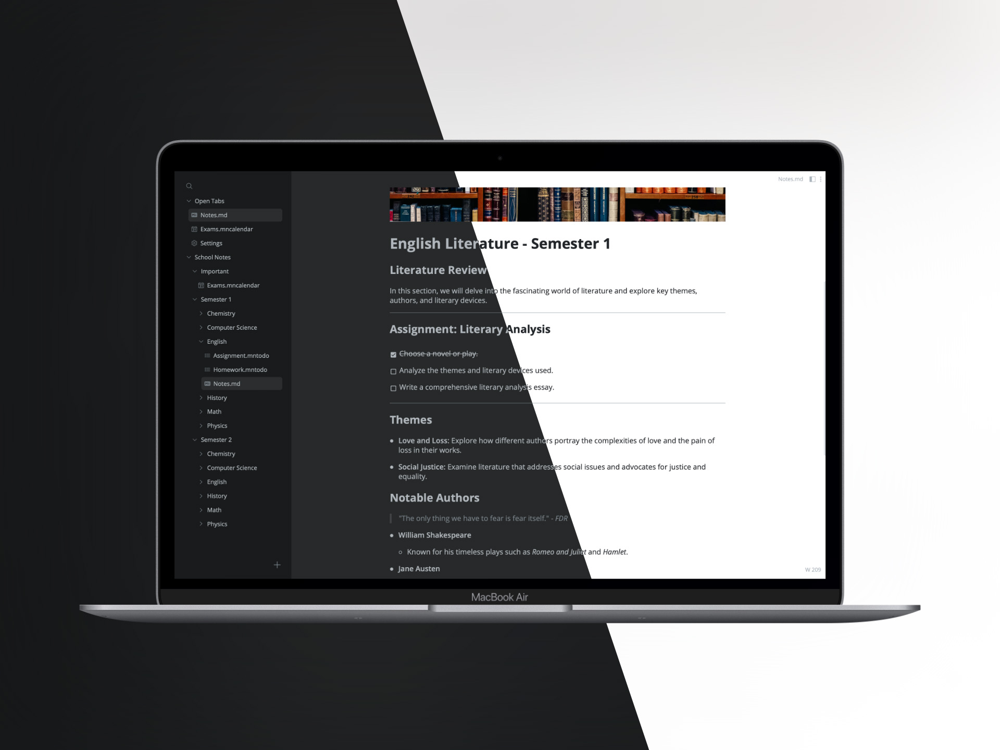

# Mnote

Mnote is an offline desktop notetaking app that takes notes in more than just text: it supports documents like Markdown, Excalidraw, kanban boards, Quire-like todo lists, and others.

[**Download**](https://github.com/gfrancine/mnote/releases/)

## Developing

See the developer docs at `mnote-docs`.